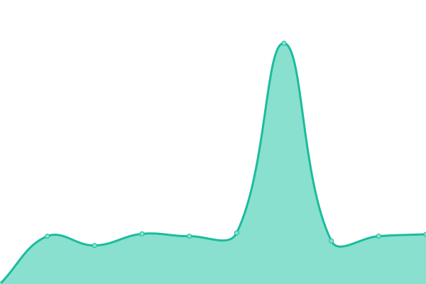
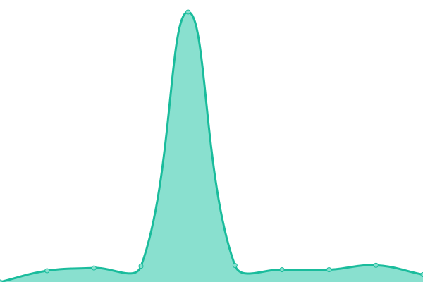

# [📈 Live Status](https://usetada.github.io/status-page): <!--live status--> **🟩 All systems operational**

This repository contains the open-source uptime monitor and status page for [TADA](https://usetada.com), powered by [Upptime](https://github.com/upptime/upptime).

With [Upptime](https://upptime.js.org), you can get your own unlimited and free uptime monitor and status page, powered entirely by a GitHub repository. We use [Issues](https://github.com/usetada/status-page/issues) as incident reports, [Actions](https://github.com/usetada/status-page/actions) as uptime monitors, and [Pages](https://usetada.github.io/status-page) for the status page.

<!--start: status pages-->
<!-- This summary is generated by Upptime (https://github.com/upptime/upptime) -->
<!-- Do not edit this manually, your changes will be overwritten -->
<!-- prettier-ignore -->
| URL | Status | History | Response Time | Uptime |
| --- | ------ | ------- | ------------- | ------ |
|  Tada Website | 🟩 Up | [tada-website.yml](https://github.com/usetada/status-page/commits/HEAD/history/tada-website.yml) | 

 4990ms
     
 | 

<a href="https://status.usetada.com/history/tada-website">99.49%</a>
    

|  Tada Insight | 🟩 Up | [tada-insight.yml](https://github.com/usetada/status-page/commits/HEAD/history/tada-insight.yml) | 

 790ms
     
 | 

<a href="https://status.usetada.com/history/tada-insight">100.00%</a>
    

|  Tada Partner Web | 🟩 Up | [tada-partner-web.yml](https://github.com/usetada/status-page/commits/HEAD/history/tada-partner-web.yml) | 

 1070ms
     
 | 

<a href="https://status.usetada.com/history/tada-partner-web">100.00%</a>
    

|  Tada Wallet Web | 🟩 Up | [tada-wallet-web.yml](https://github.com/usetada/status-page/commits/HEAD/history/tada-wallet-web.yml) | 

 1388ms
     
 | 

<a href="https://status.usetada.com/history/tada-wallet-web">100.00%</a>
    

|  Msite | 🟩 Up | [msite.yml](https://github.com/usetada/status-page/commits/HEAD/history/msite.yml) | 

 5384ms
     
 | 

<a href="https://status.usetada.com/history/msite">99.49%</a>
    

|  Delivery Website | 🟩 Up | [delivery-website.yml](https://github.com/usetada/status-page/commits/HEAD/history/delivery-website.yml) | 

 921ms
     
 | 

<a href="https://status.usetada.com/history/delivery-website">100.00%</a>
    

|  Buyfrom.io | 🟩 Up | [buyfrom-io.yml](https://github.com/usetada/status-page/commits/HEAD/history/buyfrom-io.yml) | 

 1918ms
     
 | 

<a href="https://status.usetada.com/history/buyfrom-io">100.00%</a>
    

|  Backoffice API | 🟩 Up | [backoffice-api.yml](https://github.com/usetada/status-page/commits/HEAD/history/backoffice-api.yml) | 

 669ms
     
 | 

<a href="https://status.usetada.com/history/backoffice-api">100.00%</a>
    

|  Bridge API | 🟩 Up | [bridge-api.yml](https://github.com/usetada/status-page/commits/HEAD/history/bridge-api.yml) | 

 901ms
     
 | 

<a href="https://status.usetada.com/history/bridge-api">100.00%</a>
    

|  Tada Wallet API | 🟩 Up | [tada-wallet-api.yml](https://github.com/usetada/status-page/commits/HEAD/history/tada-wallet-api.yml) | 

 855ms
     
 | 

<a href="https://status.usetada.com/history/tada-wallet-api">100.00%</a>
    

|  Tada Wallet Web API | 🟩 Up | [tada-wallet-web-api.yml](https://github.com/usetada/status-page/commits/HEAD/history/tada-wallet-web-api.yml) | 

 822ms
     
 | 

<a href="https://status.usetada.com/history/tada-wallet-web-api">100.00%</a>
    

|  Tada Partner API | 🟩 Up | [tada-partner-api.yml](https://github.com/usetada/status-page/commits/HEAD/history/tada-partner-api.yml) | 

 836ms
     
 | 

<a href="https://status.usetada.com/history/tada-partner-api">100.00%</a>
    

|  Tada Insight API | 🟩 Up | [tada-insight-api.yml](https://github.com/usetada/status-page/commits/HEAD/history/tada-insight-api.yml) | 

 853ms
     
 | 

<a href="https://status.usetada.com/history/tada-insight-api">100.00%</a>
    

|  Processor API | 🟩 Up | [processor-api.yml](https://github.com/usetada/status-page/commits/HEAD/history/processor-api.yml) | 

 659ms
     
 | 

<a href="https://status.usetada.com/history/processor-api">100.00%</a>
    

|  Evoucher API | 🟩 Up | [evoucher-api.yml](https://github.com/usetada/status-page/commits/HEAD/history/evoucher-api.yml) | 

 789ms
     
 | 

<a href="https://status.usetada.com/history/evoucher-api">100.00%</a>
    

|  Loyalty API | 🟩 Up | [loyalty-api.yml](https://github.com/usetada/status-page/commits/HEAD/history/loyalty-api.yml) | 

 854ms
     
 | 

<a href="https://status.usetada.com/history/loyalty-api">100.00%</a>
    

|  Order API | 🟩 Up | [order-api.yml](https://github.com/usetada/status-page/commits/HEAD/history/order-api.yml) | 

 827ms
     
 | 

<a href="https://status.usetada.com/history/order-api">100.00%</a>
    

|  Inventory API | 🟩 Up | [inventory-api.yml](https://github.com/usetada/status-page/commits/HEAD/history/inventory-api.yml) | 

 809ms
     
 | 

<a href="https://status.usetada.com/history/inventory-api">100.00%</a>
    

|  Payment API | 🟩 Up | [payment-api.yml](https://github.com/usetada/status-page/commits/HEAD/history/payment-api.yml) | 

 750ms
     
 | 

<a href="https://status.usetada.com/history/payment-api">100.00%</a>
    

|  Vendor API | 🟩 Up | [vendor-api.yml](https://github.com/usetada/status-page/commits/HEAD/history/vendor-api.yml) | 

 715ms
     
 | 

<a href="https://status.usetada.com/history/vendor-api">100.00%</a>
    

|  Msite API | 🟩 Up | [msite-api.yml](https://github.com/usetada/status-page/commits/HEAD/history/msite-api.yml) | 

 942ms
     
 | 

<a href="https://status.usetada.com/history/msite-api">100.00%</a>
    

|  Delivery API | 🟩 Up | [delivery-api.yml](https://github.com/usetada/status-page/commits/HEAD/history/delivery-api.yml) | 

 848ms
     
 | 

<a href="https://status.usetada.com/history/delivery-api">100.00%</a>
    

<!--end: status pages-->

[**Visit our status website →**](https://usetada.github.io/status-page)

## 📄 License

- Powered by: [Upptime](https://github.com/upptime/upptime)
- Code: [MIT](./LICENSE) © [TADA](https://usetada.com)
- Data in the `./history` directory: [Open Database License](https://opendatacommons.org/licenses/odbl/1-0/)
